# Java
- [java官方网站](http://www.oracle.com/technetwork/java/index.html)和[jdk下载地址](http://www.oracle.com/technetwork/java/javase/downloads/index.html)  
- jdk安装  
  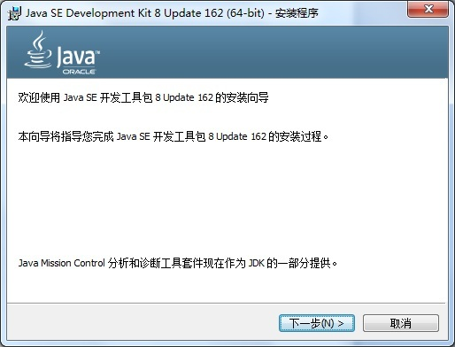  
  点击下一步  
  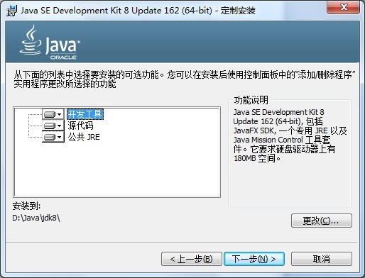  
  可以点击更改修改安装目录然后点击下一步  
  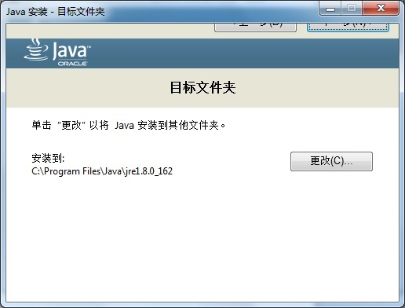  
  jre是java运行时可以不用更改修改安装目录直接点击下一步或者按回车键继续 
  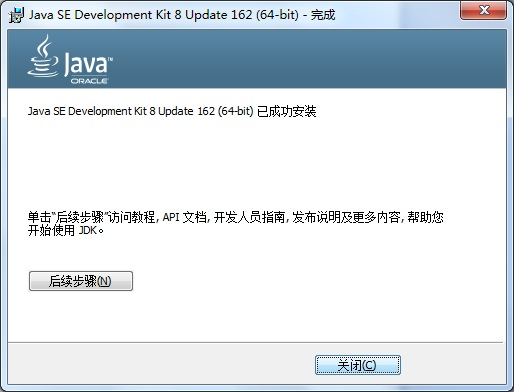  
  点击关闭完成   
- [spring开发工具官方网站](https://spring.io/tools)和[下载地址](http://download.springsource.com/release/STS/3.9.2.RELEASE/dist/e4.7/spring-tool-suite-3.9.2.RELEASE-e4.7.2-win32-x86_64.zip)  
- spring开发工具安装(需要jdk)
  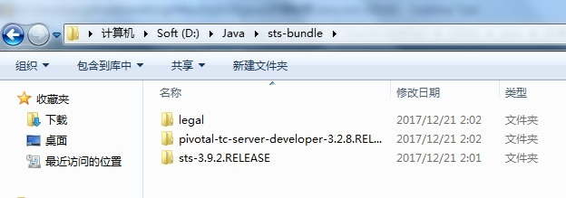  
  解压文件  
  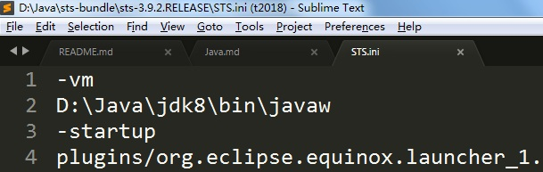  
  编辑sts目录中的sts.ini文件添加两行配置jdk安装路径  
  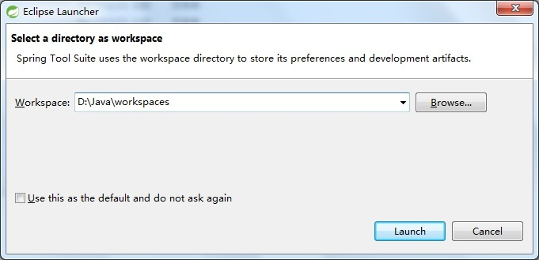  
  启动sts.exe,Workspaces为工作目录，配置文件和项目的默认保存位置，点击Launch进入  
  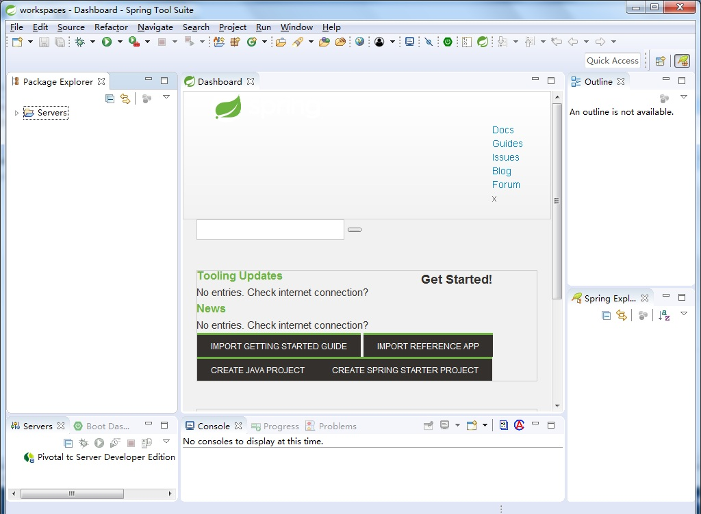  
  点击Dashboard旁边的x关闭  
  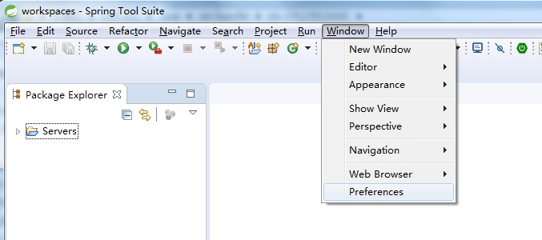  
  点击菜单Window-->preferences简单的配置开发环境  
  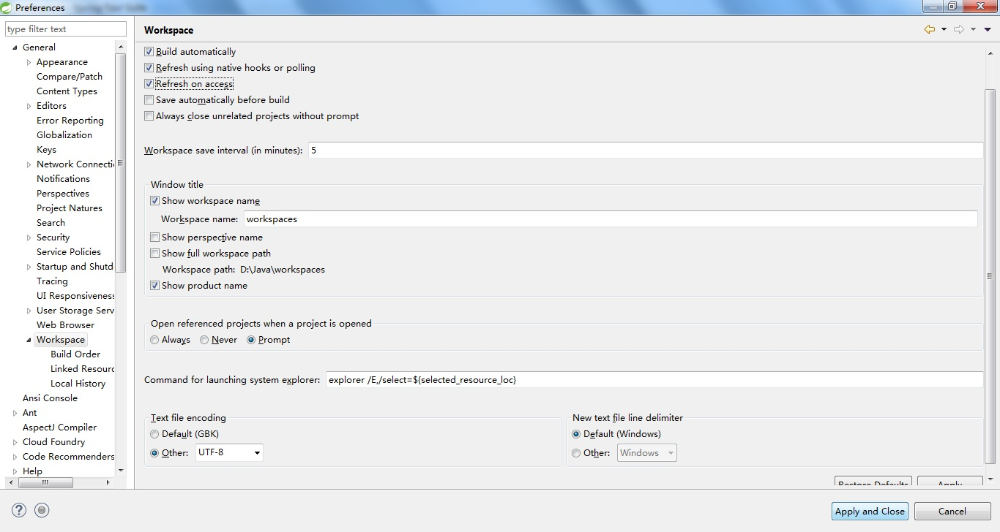  
  如图配置（刷新模式和默认文件编码）后点击Apply按钮接受改变后继续配置
  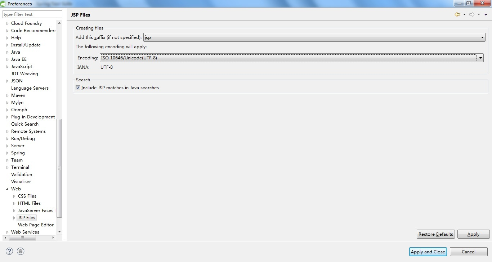  
  如图配置（默认jsp文件编码）后点击Apply and Close按钮接受改变和关闭配置界面  
- spring开发工具网站开发配置
  [tomcat(javaweb服务器)官方网站](http://tomcat.apache.org/)和[tomcat8下载地址](http://mirrors.shu.edu.cn/apache/tomcat/tomcat-8/v8.5.28/bin/apache-tomcat-8.5.28-windows-x64.zip)  
  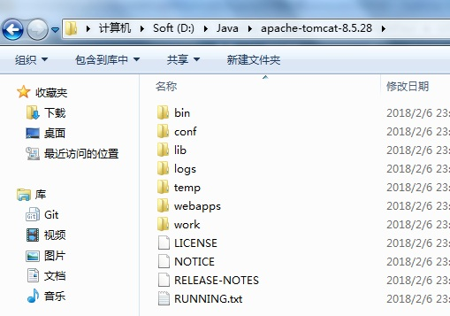  
  解压文件  
  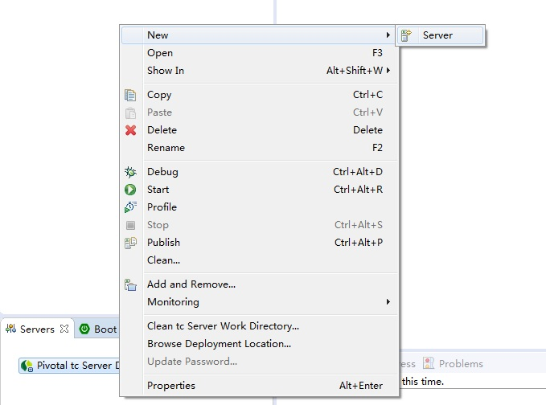  
  打开spring开发环境，右键单击Servers视图空白区域  
  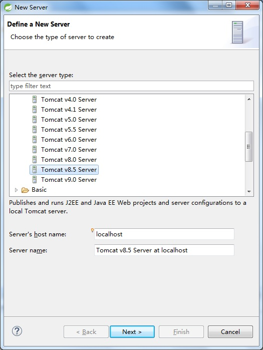  
  选择apache-Tomcat8.5 Server点击Next  
  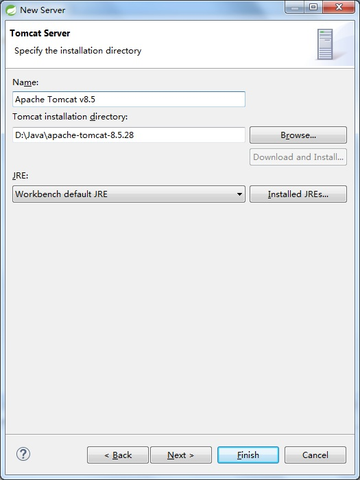  
  点击Browse...按钮选择tomcat所在目录,然后点击Finish按钮  
  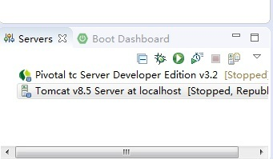  
  视图中多了tomcat完成配置  
