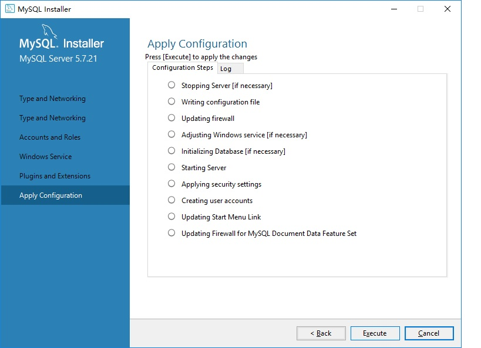

# java相关环境搭建  
## mysql  
- mysql[官方地址](https://www.mysql.com/)和[下载地址](https://dev.mysql.com/downloads/mysql/)  
- [windows版本5.7安装文件直接下载地址](https://dev.mysql.com/get/Downloads/MySQLInstaller/mysql-installer-community-5.7.21.0.msi)  
- [centos安装教程地址](https://github.com/DarkKnightPaul/centos/blob/master/README.md#%E5%AE%89%E8%A3%85mysql)
- 安装说明
    
  点击next  
    
  选择Server only(仅服务器)点击next  
    
  点击Execute  
    
  勾选后点击Install  
    
  点击next  
    
  点击Execute  
    
  点击next  
    
  点击next  
    
  点击next  
    
  点击next  
    
  点击Add User，输入mysql的用户名和密码
    
  点击next  
    
  点击next  
    
  点击next  
    
  点击Execute  
    
  点击Finish完成安装  
- mysql前端工具heidisql[官方网址](https://www.heidisql.com/)和[9.5直接下载地址](https://www.heidisql.com/installers/HeidiSQL_9.5.0.5196_Setup.exe)  
- 安装说明
    
  勾选后点击Next  
    
  点击Next  
    
  点击Next  
    
  勾选后点击Next  
    
  点击Install  
    
  勾选后点击Finish  
    
  点击新建  
    
  填写好链接信息点击打开  
    
  点击是保存链接信息  
    
  可以管理mysql  