# springboot入门  
## 新建gradle项目   
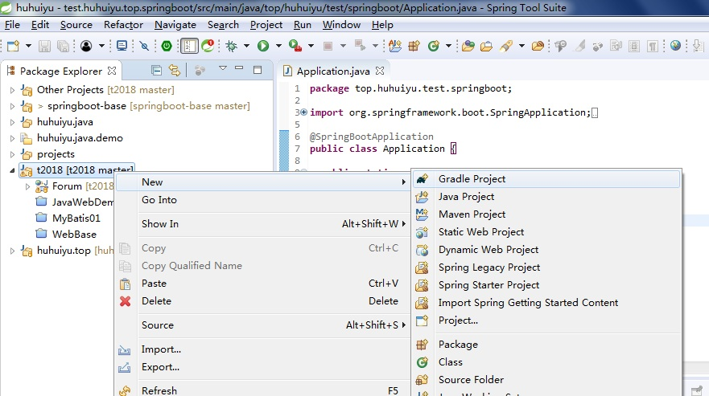  
## 下一步(next)  
  
## 填写项目名称(Project name)，点击next继续   
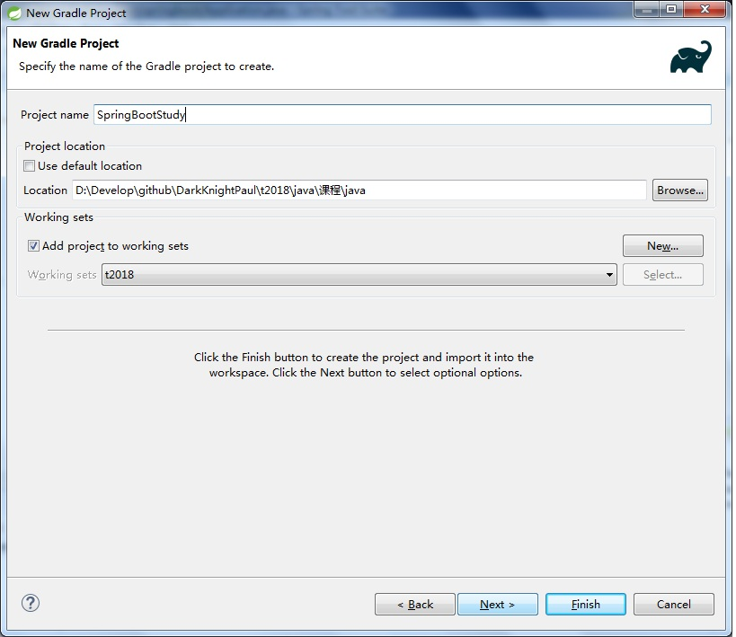  
## 下一步(next)  
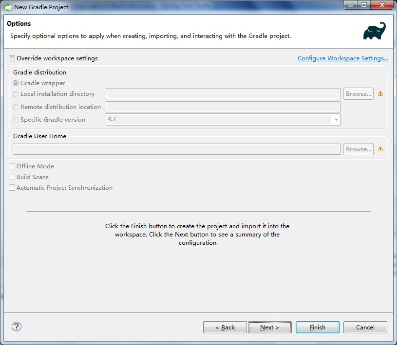  
## 等待完成  
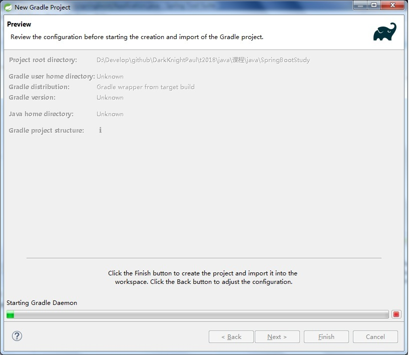  
## 点击完成(finish)  
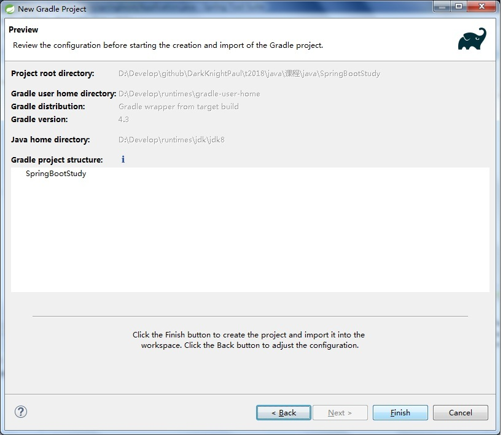  
## 项目结构,删除掉src中的所有类  
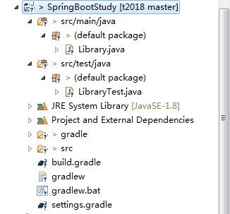  
## 打开build.gradle文件 
  
## 内容如图 [配置文件](build.gradle)  
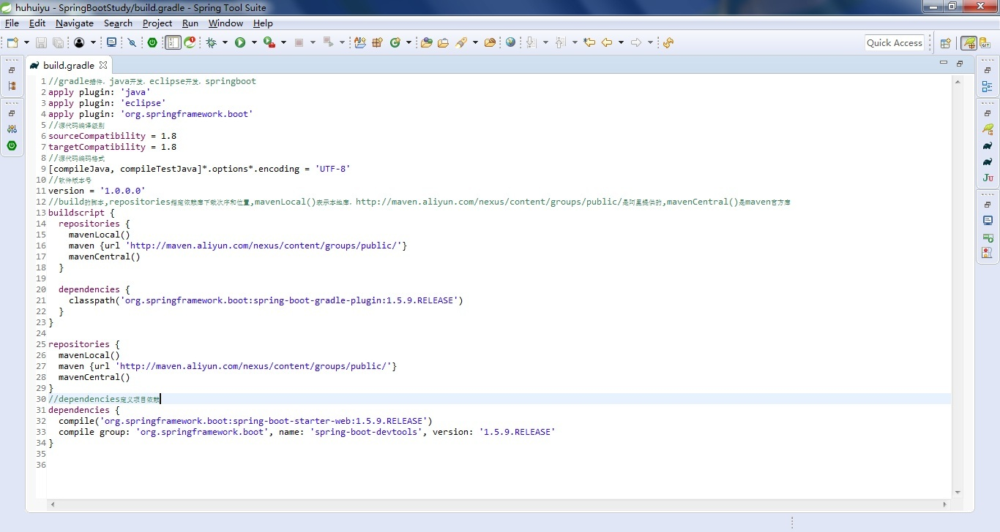  
## 更新项目，需要联网自动分析和拉取项目依赖文件     
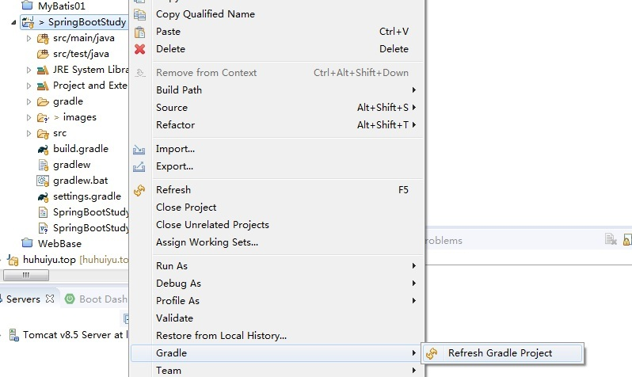  
## 更新项目后的效果   
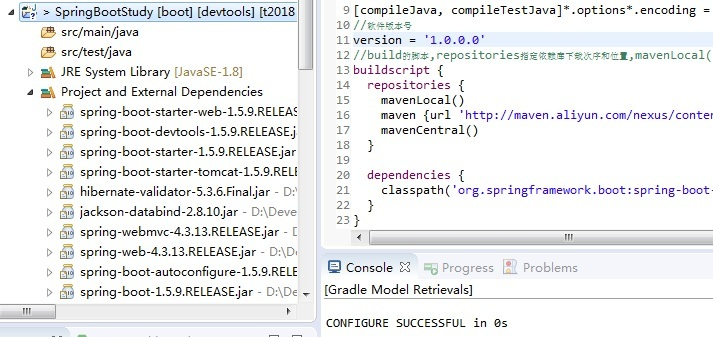  
## 创建springboot配置文件   
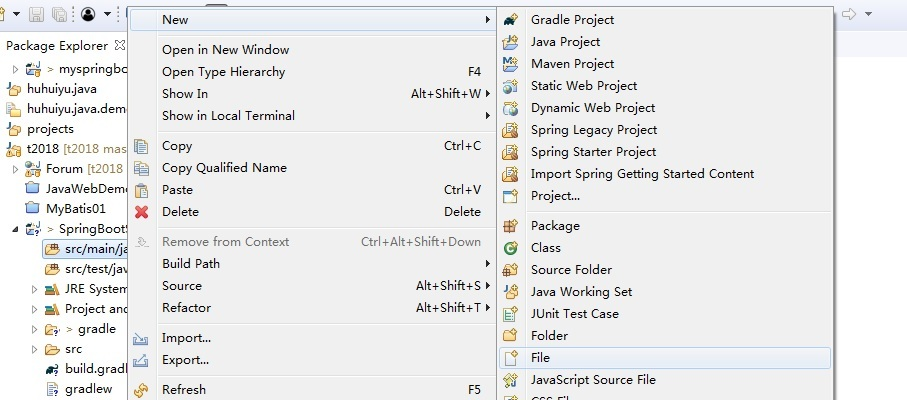  
## 文件位置和名称   
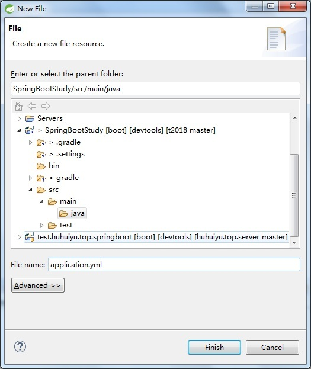  
## 配置文件内容[配置文件](src/main/java/application.yml)  
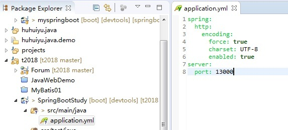  
## 编写测试控制器   
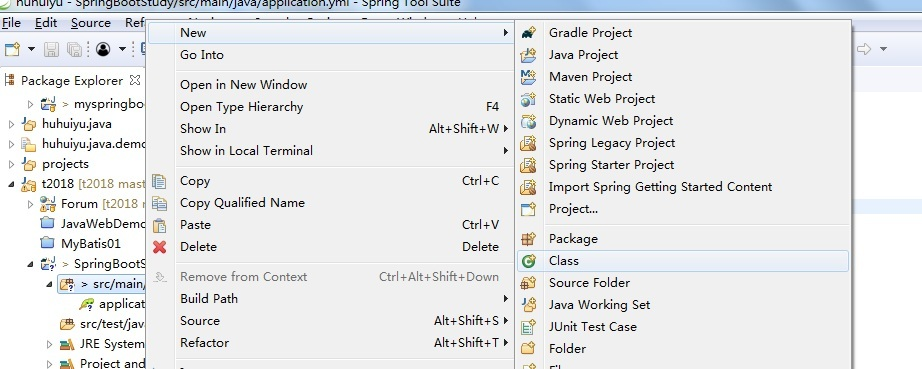  
## 包(package)和类名称  
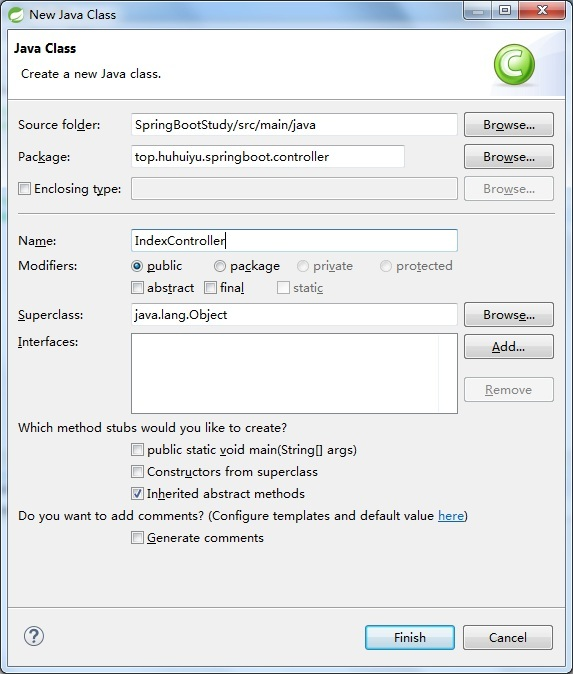  
## 控制器内容 [测试控制器](src/main/java/top/huhuiyu/springboot/controller/IndexController.java)  
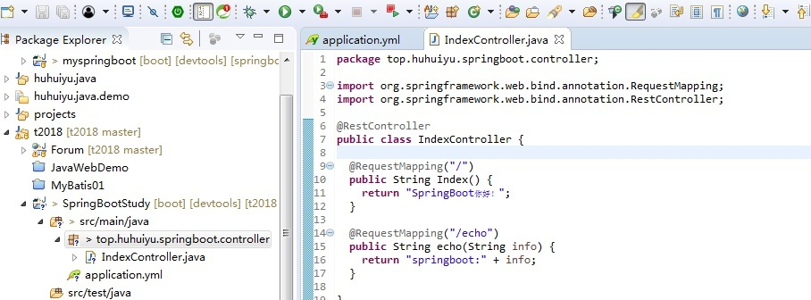  
## 编写启动类,注意包名称，修改成控制器的上一级    
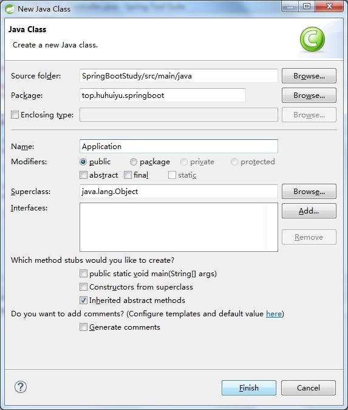  
## 启动类内容 [启动类](src/main/java/top/huhuiyu/springboot/Application.java)  
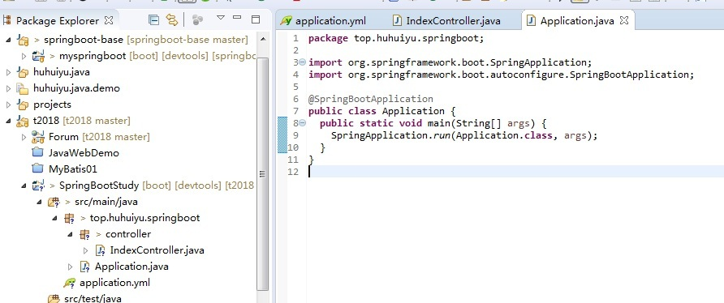  
## 用Spring Boot App方式启动  
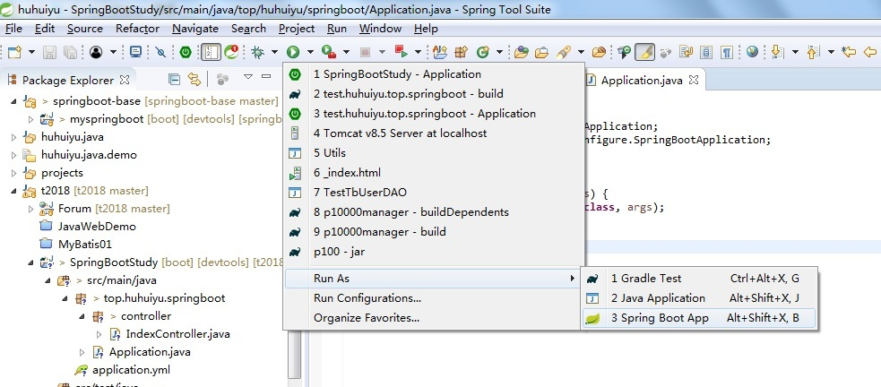  
## 等控制台显示Started  Application in...  
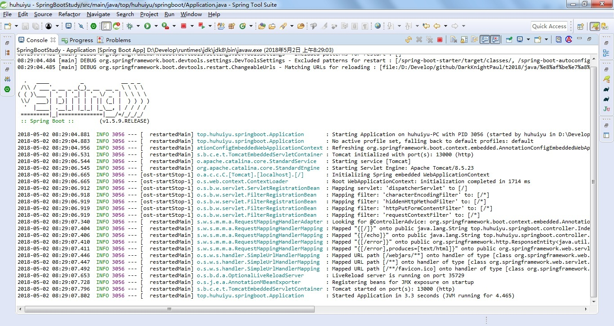  
## 打开浏览器输入127.0.0.1:13000  
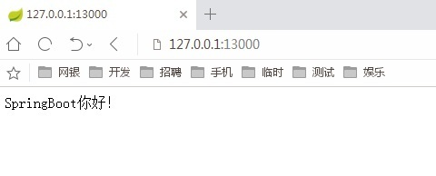  
## 输入127.0.0.1:13000/echo  
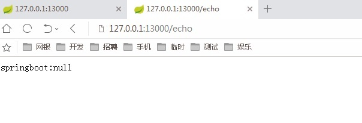  
## 输入127.0.0.1:13000/echo?info=xxxx  
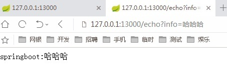  